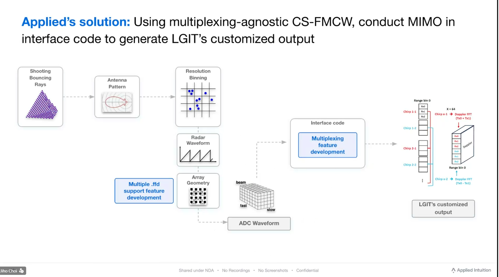

# AVX Radar Simulation Workbench

언어:

- [English](README.md)
- [한국어](README_ko.md)

이 저장소는 FMCW 레이더 파이프라인을 개발하고 검증하기 위한 레이더 시뮬레이션 워크벤치입니다.

주요 runtime track:

- low fidelity: `RadarSimPy + FFD`
- high fidelity: `Sionna-style RT`, `PO-SBR` 같은 ray-tracing 기반 경로

포함 내용:

- `src/avxsim`의 Python simulation / DSP / runtime adapter
- `frontend/graph_lab`의 브라우저 기반 operator UI
- `scripts`의 launcher / validator / gate
- `docs`의 구조, 사용법, release 문서

설명 문서 vs 증거 산출물:

- 설명: [Documentation Index](docs/README.md)
- 증거: [Generated Reports Index](docs/reports/README.md)

## 처음 10분

먼저 공통으로 아래를 실행합니다.

1. 기본 환경 생성

```bash
python3 -m venv .venv
. .venv/bin/activate
python -m pip install --upgrade pip
python -m pip install numpy matplotlib
```

2. backend/API 경로 검증

```bash
PYTHONPATH=src .venv/bin/python scripts/validate_web_e2e_orchestrator_api.py
```

그 다음 두 경로 중 하나를 고르면 됩니다.

### 경로 A: Graph Lab

실행:

```bash
PY_BIN=.venv/bin/python scripts/run_graph_lab_local.sh 8081 8101
```

브라우저:

- `http://127.0.0.1:8081/frontend/graph_lab_reactflow.html?api=http://127.0.0.1:8101`

이 경로는 아래 목적에 맞습니다.

- runtime 선택
- compare workflow
- artifact inspection
- decision brief export

### 경로 B: Classic Dashboard

실행:

```bash
PY_BIN=.venv/bin/python scripts/run_web_e2e_dashboard_local.sh 8080 8099
```

브라우저:

- `http://127.0.0.1:8080/frontend/avx_like_dashboard.html?summary=/docs/reports/frontend_quickstart_v1.json&api=http://127.0.0.1:8099`

이 경로는 아래 목적에 맞습니다.

- 가장 단순한 demo shell
- 빠른 API/dashboard smoke path
- 가벼운 프레젠테이션 화면

둘 중 하나라도 성공하면 다음 문서로 진행하면 됩니다.

- [Install Onboarding Map](docs/288_install_onboarding_map.md)
- [Frontend Runtime Purpose Presets](docs/280_frontend_runtime_purpose_presets.md)

<a id="paid-radarsimpy-production-validation-ko"></a>

## 유료 RadarSimPy Production Validation

이 경로는 아래가 준비된 경우에만 사용합니다.

- RadarSimPy runtime 설치 완료
- 유료 `.lic` 또는 동등한 production 접근 권한 확보

먼저 볼 문서:

- [RadarSimPy Runtime](docs/285_install_radarsimpy_runtime.md)

실행:

```bash
PYTHONPATH=src .venv/bin/python scripts/run_radarsimpy_paid_6m_gate_ci.sh
```

다음 리포트를 확인하면 됩니다.

- `docs/reports/radarsimpy_production_release_gate_latest.json`
- `docs/reports/radarsimpy_readiness_checkpoint_latest.json`
- `docs/reports/radarsimpy_wrapper_integration_gate_production_latest.json`
- `docs/reports/radarsimpy_integration_smoke_gate_production_latest.json`

## 누구에게 어떤 경로가 맞는가

| 내가 해당하는 경우 | 먼저 볼 것 | 다음 단계 |
| --- | --- | --- |
| 저장소를 처음 보는 사용자 | [README_ko.md](README_ko.md) | [Install Onboarding Map](docs/288_install_onboarding_map.md) |
| frontend operator | [README_ko.md](README_ko.md) | `scripts/run_graph_lab_local.sh`, [Frontend Runtime Purpose Presets](docs/280_frontend_runtime_purpose_presets.md) |
| backend / validation 개발자 | [Project Structure And User Manual](docs/282_project_structure_and_user_manual.md) | `src/avxsim`, `scripts/validate_*`, `scripts/run_*` |
| 유료 RadarSimPy runtime 검증 담당 | [유료 RadarSimPy Production Validation](#paid-radarsimpy-production-validation-ko) | [RadarSimPy Runtime](docs/285_install_radarsimpy_runtime.md), `scripts/run_radarsimpy_paid_6m_gate_ci.sh` |
| 어떤 runtime 설치 경로를 골라야 할지 모름 | [Install Onboarding Map](docs/288_install_onboarding_map.md) | 목적에 맞는 설치 가이드 |

## Frontend Preview

Graph Lab은 runtime 선택, compare workflow, artifact inspection, decision export를 담당하는 메인 UI입니다.


관련 문서:

- [Frontend Runtime Purpose Presets](docs/280_frontend_runtime_purpose_presets.md)
- [프로젝트 구조 및 사용자 매뉴얼 (한국어)](docs/283_project_structure_and_user_manual_ko.md)

## 어떤 문서가 가장 적절한가?

둘 다 필요합니다.

1. `README.md`
   - GitHub 첫 화면용
   - 짧은 개요, quick install, quick run, 문서 index
2. `README_ko.md`
   - 한국어 entry page
   - 빠른 개요와 링크 허브
3. `docs/283_project_structure_and_user_manual_ko.md`
   - 실제 상세 사용자 매뉴얼
   - 구조, 설치, 사용법, 트러블슈팅
4. `docs/README.md`
   - `docs/` 전체 문서 허브
   - 목적별로 어떤 문서를 읽어야 하는지 정리

## 저장소 구조

```text
src/avxsim/     코어 simulation, DSP, runtime adapter, API
frontend/       브라우저 UI: Graph Lab, dashboard
scripts/        launcher, validator, gate, report builder
docs/           아키텍처, 사용자 가이드, 계약 문서, release 문서
configs/        tuning / config 자산
data/           demo scene, runtime record, generated artifact
external/       선택적 third-party runtime 및 reference repo
tests/          fixture와 test data
```

상세 문서:

- [Documentation Index](docs/README.md)
- [프로젝트 구조 및 사용자 매뉴얼 (한국어)](docs/283_project_structure_and_user_manual_ko.md)
- [Project Structure And User Manual](docs/282_project_structure_and_user_manual.md)
- [Architecture](docs/03_architecture.md)

생성 리포트 인덱스:

- [Generated Reports Index](docs/reports/README.md)

## 아키텍처

핵심 파이프라인은 runtime backend를 바꿔도 downstream ADC/map consumer가 깨지지 않도록 안정적인 interface 중심으로 설계되어 있습니다.



핵심 모듈:

- `PathGenerator`
  - `paths_by_chirp` 생성
- `AntennaModel`
  - complex TX/RX gain 계산
- `FmcwMultiplexingSynthesizer`
  - radar params, path, multiplexing plan을 ADC cube로 변환
- `OutputWriter`
  - `path_list.json`, `adc_cube.npz`, `radar_map.npz`, optional LGIT output 저장

의존 규칙:

- `PathGenerator -> Synthesizer <- AntennaModel`
- `OutputWriter`는 generator 내부 구현이 아니라 contract에만 의존

## 설치 가이드

- [Install Onboarding Map](docs/288_install_onboarding_map.md)
- [Base Environment](docs/284_install_base_environment.md)
- [RadarSimPy Runtime](docs/285_install_radarsimpy_runtime.md)
- [Sionna-Style RT Runtime](docs/286_install_sionna_style_rt_runtime.md)
- [PO-SBR Runtime](docs/287_install_po_sbr_runtime.md)
- [Documentation Index](docs/README.md)

## 빠른 시작

### 1. 기본 환경

```bash
python3 -m venv .venv
. .venv/bin/activate
python -m pip install --upgrade pip
python -m pip install numpy matplotlib
```

선택적 브라우저 E2E:

```bash
python -m pip install playwright
python -m playwright install chromium
```

### 2. Classic Dashboard Demo 실행

```bash
PY_BIN=.venv/bin/python scripts/run_web_e2e_dashboard_local.sh 8080 8099
```

브라우저:

- `http://127.0.0.1:8080/frontend/avx_like_dashboard.html?summary=/docs/reports/frontend_quickstart_v1.json&api=http://127.0.0.1:8099`

### 3. Graph Lab 실행

```bash
PY_BIN=.venv/bin/python scripts/run_graph_lab_local.sh 8081 8101
```

브라우저:

- `http://127.0.0.1:8081/frontend/graph_lab_reactflow.html?api=http://127.0.0.1:8101`

### 4. Backend/API contract 검증

```bash
PYTHONPATH=src .venv/bin/python scripts/validate_web_e2e_orchestrator_api.py
```

### 5. 선택적 Graph Lab 브라우저 E2E

```bash
PLAYWRIGHT_BROWSERS_PATH=/tmp/pw-browsers \
PYTHONPATH=src .venv/bin/python \
scripts/validate_graph_lab_playwright_e2e.py \
  --require-playwright \
  --output-json docs/reports/graph_lab_playwright_e2e_latest.json
```

## 주요 사용자 흐름

### Frontend operator flow

Graph Lab에서 주로 하는 일:

- runtime track 선택
- 현재 graph/session 실행
- low fidelity vs high fidelity 비교
- artifact, diagnostics, decision brief 확인

관련 문서:

- [Frontend Runtime Purpose Presets](docs/280_frontend_runtime_purpose_presets.md)
- [Frontend Dashboard Usage](docs/116_frontend_dashboard_usage.md)

### Runtime track

- `RadarSimPy + FFD`
  - 빠른 low-fidelity 기준선
- `Sionna-style RT`
  - higher-fidelity ray-tracing 지향 경로
- `PO-SBR`
  - higher-fidelity physical optics / SBR 지향 경로

### 주요 산출물

- `path_list.json`
- `adc_cube.npz`
- `radar_map.npz`
- optional `lgit_customized_output.npz`

## 상세 매뉴얼

상세 문서:

- [Documentation Index](docs/README.md)
- [프로젝트 구조 및 사용자 매뉴얼 (한국어)](docs/283_project_structure_and_user_manual_ko.md)
- [Project Structure And User Manual](docs/282_project_structure_and_user_manual.md)

설치 문서:

- [Base Environment](docs/284_install_base_environment.md)
- [RadarSimPy Runtime](docs/285_install_radarsimpy_runtime.md)
- [Sionna-Style RT Runtime](docs/286_install_sionna_style_rt_runtime.md)
- [PO-SBR Runtime](docs/287_install_po_sbr_runtime.md)

## 고급 / Production 검증

유료 또는 production 수준 RadarSimPy 검증:

- `scripts/run_radarsimpy_paid_6m_gate_ci.sh`
- `scripts/run_radarsimpy_production_release_gate.py`
- `scripts/run_radarsimpy_readiness_checkpoint.py`
- `scripts/validate_radarsimpy_simulator_reference_parity_optional.py`

## 문서 구조 권장안

신규 사용자를 돕는 목적이라면:

- GitHub 첫 화면 요약: [README.md](README.md)
- 한국어 landing page: [README_ko.md](README_ko.md)
- 실제 상세 매뉴얼: [docs/283_project_structure_and_user_manual_ko.md](docs/283_project_structure_and_user_manual_ko.md)

이 구조가 GitHub 가시성, 한국어 온보딩, 장기 유지보수 측면에서 가장 적절합니다.
