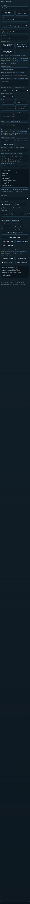

# Graph Lab UX 사용 매뉴얼

## 목적

이 문서는 `frontend/graph_lab`의 메인 operator UI를 실제로 사용하는 방법을 설명합니다.

다음이 필요할 때 이 문서를 사용하면 됩니다.

- 화면 구성을 빠르게 파악하고 싶을 때
- 주요 버튼이 무엇을 하는지 알고 싶을 때
- frontend와 backend 연결이 실제로 되는지 확인하고 싶을 때
- low-vs-high compare를 표준 절차대로 실행하고 싶을 때
- decision brief까지 export하고 싶을 때

이 문서는 `Graph Lab` 기준입니다.

가벼운 demo shell은 [Frontend Dashboard Usage](116_frontend_dashboard_usage.md)를 사용하면 됩니다.

## Graph Lab 실행

실행:

```bash
PY_BIN=.venv/bin/python scripts/run_graph_lab_local.sh 8081 8101
```

브라우저:

- `http://127.0.0.1:8081/frontend/graph_lab_reactflow.html?api=http://127.0.0.1:8101`

backend health 빠른 확인:

```bash
curl http://127.0.0.1:8101/health
```

처음 정상 신호:

- 페이지가 열린다
- 중앙 canvas가 보인다
- 좌우 side panel이 보인다
- `Run Graph (API)` 후 새로운 `graph_run_id`가 생긴다

## 화면 구성

전체 화면:


주요 영역:

1. 왼쪽 패널
   - graph setup
   - runtime configuration
   - template loading
   - graph execution
2. 중앙 canvas
   - node/edge 기반 graph 편집
3. 오른쪽 패널
   - `Decision Pane`
   - `Artifact Inspector`
   - compare 상태와 export 동작

왼쪽 패널 예시:



Decision Pane 예시:


Artifact Inspector 예시:


## 왼쪽 패널: Graph Setup과 Runtime

### Graph Setup 버튼

| 버튼 | 언제 쓰는가 | 결과 |
| --- | --- | --- |
| `Load #1` | known-good 시작 graph가 필요할 때 | 첫 template를 canvas에 로드 |
| `Node Palette`의 node chip | node를 수동으로 추가할 때 | 선택한 타입의 node 추가 |
| `Validate Graph Contract` | backend run 전에 | schema/profile/DAG 제약 검사 |
| `Run Graph (API)` | 현재 graph를 backend에 실제 실행할 때 | API를 통해 graph 실행 |
| `Retry Last Run` | 직전 run을 다시 시도할 때 | 마지막 run 재실행 |
| `Cancel Last Run` | 긴 run을 멈추고 싶을 때 | 마지막 run 취소 요청 |
| `Poll Last Run` | rerun 없이 상태만 새로 보고 싶을 때 | 마지막 run 상태 갱신 |
| `Refresh Guard` | contract overlay 상태가 낡아 보일 때 | contract diagnostics 갱신 |
| `Reset Guard` | contract diagnostics를 초기화할 때 | guard state 초기화 |
| `Clear Timeline` | overlay timeline이 너무 많을 때 | timeline 비움 |

### Runtime 패널

가장 중요한 항목:

| 항목 | 목적 |
| --- | --- |
| `Low Fidelity: RadarSimPy + FFD` | 빠른 baseline 경로 |
| `High Fidelity: Sionna-style RT` | 선택적 Sionna-style 경로 |
| `High Fidelity: PO-SBR` | 현재 기본 high-fidelity 경로 |
| `Runtime Backend` | 실제 backend 계열 선택 |
| `Runtime Provider` | 정확한 provider entry point 선택 |
| `Runtime Required Modules` | 필요한 module 명시 |
| `Failure Policy` | 실패 시 hard fail 또는 fallback |
| `Simulation Mode` | analytic path 또는 RadarSimPy ADC 선택 |
| `Multiplexing Mode` | `tdm`, `bpm`, `custom` |
| `License Tier` | `trial` 또는 `production` |
| `License File` | 실제 paid `.lic` 경로 |
| `TX FFD Files` / `RX FFD Files` | antenna pattern 입력 |
| `Runtime Diagnostics` | 계획/관측 runtime 상태 요약 |

### Runtime preset 의미

| preset | 일반적인 용도 |
| --- | --- |
| `Low Fidelity: RadarSimPy + FFD` | 빠른 baseline 및 compare 기준 |
| `High Fidelity: Sionna-style RT` | 선택적 ray-tracing 지향 경로 |
| `High Fidelity: PO-SBR` | 현재 release 기준 기본 high-fidelity 경로 |

## 오른쪽 패널: Decision Pane

`Decision Pane`은 compare, gate, session, export를 처리하는 영역입니다.

### Compare 버튼

| 버튼 | 언제 쓰는가 | 결과 |
| --- | --- | --- |
| `Load Compare` | 이미 비교할 `graph_run_id`를 알고 있을 때 | 해당 run을 compare로 로드 |
| `Use Current as Compare` | 현재 run을 compare 기준으로 고정할 때 | 현재 run을 compare reference로 pin |
| `Clear Compare` | compare 기준을 지울 때 | compare 상태 초기화 |
| `Run Preset Pair Compare` | baseline-target pair를 순서대로 실행할 때 | `baseline_preset -> target_preset` 실행 |
| `Run Low -> Current Compare` | 기본 low-vs-current fast path를 쓸 때 | low baseline 후 current config 실행 |

### Inspector mirror 버튼

이 버튼들은 `Decision Pane`에서 `Artifact Inspector`를 직접 제어합니다.

| 버튼 | 결과 |
| --- | --- |
| `Collapse Inspector Evidence` | inspector 상세 섹션 접기 |
| `Expand Inspector Evidence` | inspector 상세 섹션 펼치기 |
| `Reset Inspector Layout` | inspector fold/layout 상태 초기화 |
| `Apply Recommended Audit Action` | 추천 audit maintenance 적용 |
| `Clear Action Trail` | inspector action audit 기록 삭제 |
| `Clear Maintenance Marker` | maintenance marker 제거 |
| `Clear Last Clear Record` | 마지막 clear provenance 제거 |

### Decision/export 버튼

| 버튼 | 언제 쓰는가 | 결과 |
| --- | --- | --- |
| `Policy Gate` | current-vs-compare pair가 최종 판단 준비되었을 때 | gate 결과 계산 |
| `Run Session` | decision/regression session을 남길 때 | session 기록 생성 |
| `Export Session` | session artifact가 필요할 때 | session summary export |
| `Export Gate` | gate evidence를 따로 저장할 때 | gate evidence export |
| `Export Brief` | 전달용 요약이 필요할 때 | decision brief markdown export |

### Compare history 영역

`Compare Session History`는 compare를 한 번 이상 실행한 뒤부터 유용합니다.

주요 기능:

- 과거 pair 재실행
- pin/save/delete
- history export/import
- retention policy 관리

정확한 compare-history 기능은 [Frontend Runtime Purpose Presets](280_frontend_runtime_purpose_presets.md)에 더 자세히 정리되어 있습니다.

## 오른쪽 패널: Artifact Inspector

`Artifact Inspector`는 evidence 확인용 패널입니다.

여기서 보는 것:

- current artifact 존재 여부
- compare-vs-current evidence
- shape, path, peak-bin drift
- runtime source change
- audit와 maintenance 상태

로컬 버튼:

| 버튼 | 결과 |
| --- | --- |
| `Apply Recommended Audit Action` | 추천 audit cleanup 적용 |
| `Clear Action Trail` | retained action audit trail 삭제 |
| `Clear Maintenance Marker` | maintenance marker 제거 |
| `Clear Last Clear Record` | last-clear provenance 제거 |

## 추천 실행 순서

### 순서 1: frontend/backend sanity check

1. `scripts/run_graph_lab_local.sh 8081 8101` 실행
2. URL 열기
3. `Load #1` 클릭
4. `Validate Graph Contract` 클릭
5. runtime panel에서 `Low Fidelity: RadarSimPy + FFD` 클릭
6. `Run Graph (API)` 클릭
7. 아래를 확인
   - 새로운 `graph_run_id`
   - `Runtime Diagnostics`의 실제 backend/provider 상태
   - 오른쪽 패널의 artifact 정보 갱신

### 순서 2: low-vs-high compare

1. low-fidelity baseline 실행
   - `Low Fidelity: RadarSimPy + FFD`
   - `Run Graph (API)`
2. `Use Current as Compare` 클릭
3. target high-fidelity path 선택
   - `High Fidelity: PO-SBR`
   - 또는 `High Fidelity: Sionna-style RT`
4. 필요하면 advanced runtime 입력 보완
5. `Run Graph (API)` 다시 실행
6. 아래를 읽기
   - `Track Compare Workflow`
   - `Preset Pair Compare`
   - `Artifact Inspector`
7. pair가 최종이면 `Policy Gate`
8. 이어서 `Run Session`, `Export Brief`

빠른 경로:

1. target runtime 설정
2. `Run Low -> Current Compare`
3. 자동 생성된 compare 결과 확인

### 순서 3: preset pair compare

1. `Preset Pair Compare`에서 `baseline_preset` 선택
2. `target_preset` 선택
3. 필요하면 quick shortcut 사용
   - `Low -> Current`
   - `Low -> Sionna`
   - `Low -> PO-SBR`
4. `Run Preset Pair Compare`
5. 아래를 확인
   - selected pair forecast
   - compare runner status
   - `Artifact Inspector`의 compare assessment

### 순서 4: 전달용 decision package export

1. compare pair를 최종 상태로 확정
2. `Policy Gate`
3. `Run Session`
4. `Export Gate`
5. `Export Session`
6. `Export Brief`

## backend 연결이 정상이라는 증거

가장 실용적인 확인 기준:

1. `Run Graph (API)` 후 유효한 `graph_run_id`가 생긴다
2. `Runtime Diagnostics`가 planned에서 observed 상태로 바뀐다
3. `Decision Pane` compare 버튼이 실제 run에 반영된다
4. `Artifact Inspector`에 current/compare artifact evidence가 보인다
5. 최신 browser E2E report가 green이다
   - [graph_lab_playwright_e2e_latest.json](reports/graph_lab_playwright_e2e_latest.json)

## 자주 발생하는 문제

### `Run Graph (API)`가 run을 만들지 못한다

이 순서로 확인:

1. `:8101` backend health
2. `Validate Graph Contract`
3. runtime provider와 module 필드
4. `Runtime Diagnostics`

### compare runner가 blocked 된다

대부분 원인:

- 필요한 runtime module 미설치
- 선택한 runtime에 license 또는 repo path가 필요함
- target preset 입력이 미완성

### paid RadarSimPy path가 production처럼 동작하지 않는다

확인:

- `License Tier = production`
- `License File`이 실제 `.lic`를 가리키는지
- [Generated Reports Index](reports/README.md)의 paid RadarSimPy evidence

## 관련 문서

- [Frontend Runtime Purpose Presets](280_frontend_runtime_purpose_presets.md)
- [Project Structure And User Manual](282_project_structure_and_user_manual.md)
- [프로젝트 구조 및 사용자 매뉴얼](283_project_structure_and_user_manual_ko.md)
- [Documentation Index](README.md)
- [Generated Reports Index](reports/README.md)
