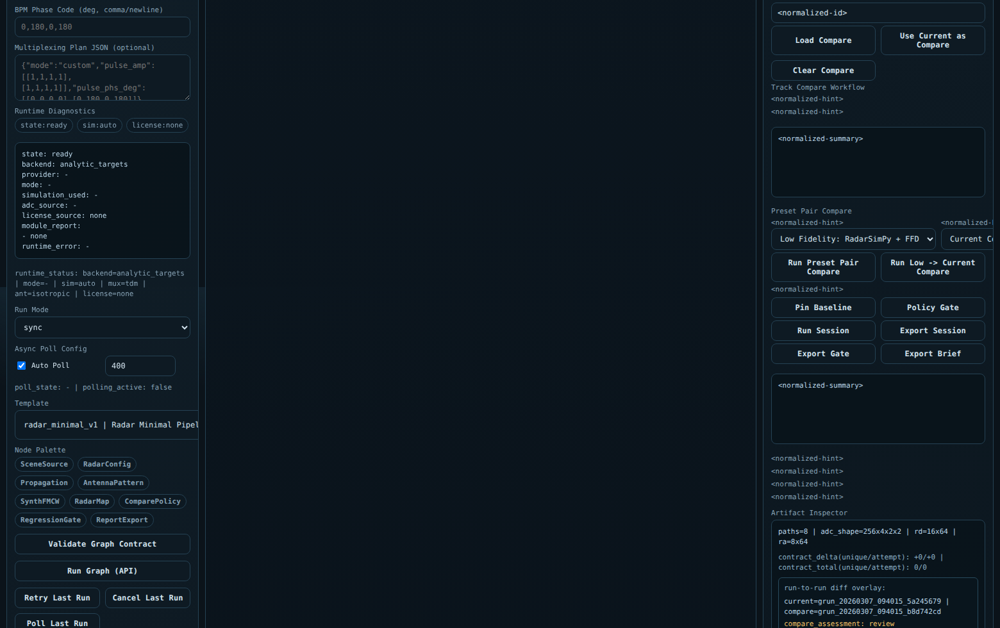
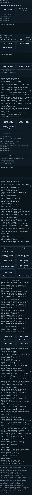
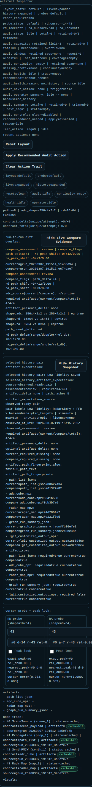

# Graph Lab Button Scenario Guide

## Purpose

This guide explains Graph Lab buttons by operator intent.

Use it when:

- there are too many buttons to parse at once
- you want to know which button matters for a specific task
- you want a short click sequence instead of reading the whole UX manual

For the full screen walkthrough, use [Graph Lab UX Manual](300_graph_lab_ux_manual.md).

## Screen Reference

Full screen:

Decision area:

Artifact area:

If you want only the right-panel reading order, use [Artifact Inspector Quick Guide](304_artifact_inspector_quick_guide.md).

## Scenario 1: I Just Want To See A Graph On The Canvas

Use this when the canvas is empty and you only want a known-good template.

Where:

- left panel

Buttons:

1. `Refresh Templates`
   - refreshes the template list from the backend
2. `Load #1`
   - loads the first template into the canvas

Expected result:

- 4 nodes appear on the canvas
  - `SceneSource`
  - `Propagation`
  - `SynthFMCW`
  - `RadarMap`

If it does not work:

- hard refresh the browser
- make sure the page is using the current Graph Lab server

## Scenario 2: I Want To Check If The Graph Is Valid Before Running

Use this before any backend execution.

Where:

- left panel

Buttons:

1. `Load #1`
2. `Validate Graph Contract`

Expected result:

- right panel `Validation Result`
- `valid: true`
- node and edge counts shown

Do not run the backend first if validation is red.

## Scenario 3: I Want The Simplest Successful Backend Run

Use this for the first end-to-end sanity check.

Where:

- left panel runtime section
- left panel run button

Buttons and fields:

1. `Load #1`
2. `Low Fidelity: RadarSimPy + FFD`
3. check:
   - `Runtime Backend = radarsimpy_rt`
   - `Simulation Mode = radarsimpy_adc` or the preset-filled equivalent
4. `Run Graph (API)`

Expected result:

- top status shows `graph run completed`
- right panel `Graph Run Result`
- `status: completed`
- artifact paths appear

Healthy evidence:

- `path_list.json`
- `adc_cube.npz`
- `radar_map.npz`
- `graph_run_summary.json`

## Scenario 4: I Want To Know Why Run Failed

Use this when `Run Graph (API)` ends in failure.

Where to read:

- top status bar
- right panel `Graph Run Result`
- left panel `Runtime Diagnostics`

Meaning of the main retry buttons:

| Button | Use it when |
| --- | --- |
| `Retry Last Run` | the run failed but configuration is still the same |
| `Poll Last Run` | async state may have changed and you only need a refresh |
| `Cancel Last Run` | a long run should stop |

Common causes:

| What you see | Meaning | What to do next |
| --- | --- | --- |
| `required runtime modules unavailable` | the backend module is missing | install or expose the required runtime |
| license-related warning or error | runtime access is blocked by license state | set `License Tier` and `License File` correctly |
| validation problems | graph contract is not acceptable | run `Validate Graph Contract` first |
| provider/path errors | backend-specific runtime inputs are incomplete | fill advanced runtime fields |

## Scenario 5: I Want To Compare Low Fidelity And High Fidelity

Use this for the main operator comparison workflow.

Where:

- left panel runtime presets
- right panel `Decision Pane`

Buttons:

1. `Load #1`
2. `Low Fidelity: RadarSimPy + FFD`
3. `Run Graph (API)`
4. `Use Current as Compare`
5. choose one:
   - `High Fidelity: PO-SBR`
   - `High Fidelity: Sionna-style RT`
6. `Run Graph (API)` again

Then read:

- `Track Compare Workflow`
- `Preset Pair Compare`
- `Artifact Inspector`

Expected result:

- current run and compare run both exist
- compare evidence appears in the right panel

## Scenario 6: I Want The Fastest Auto Compare

Use this when you do not want to manually pin the baseline.

Where:

- right panel `Decision Pane`

Buttons:

1. configure the target runtime in the left panel
2. `Run Low -> Current Compare`

Expected result:

- low-fidelity baseline is built automatically
- current config is run automatically
- compare state is filled

If blocked:

- the low-fidelity runtime path is not currently available

## Scenario 7: I Want To Compare Preset To Preset

Use this when you want a reproducible pair instead of manual switching.

Where:

- right panel `Preset Pair Compare`

Buttons and fields:

1. choose `baseline_preset`
2. choose `target_preset`
3. optional shortcuts:
   - `Low -> Current`
   - `Low -> Sionna`
   - `Low -> PO-SBR`
4. click `Run Preset Pair Compare`

Read next:

- selected pair forecast
- compare runner status
- compare assessment

## Scenario 8: I Want To View Generated Artifacts

Use this after a successful run.

Where:

- right panel, scroll down to `Artifact Inspector`

What to read:

- `artifacts:`
- `node trace:`
- `visuals:`

Buttons in that area:

| Button | Meaning |
| --- | --- |
| `Collapse Inspector Evidence` | hide inspector detail |
| `Expand Inspector Evidence` | reopen inspector detail |
| `Reset Inspector Layout` | restore inspector layout defaults |
| `Apply Recommended Audit Action` | apply suggested audit cleanup |

## Scenario 9: I Want To Decide And Export

Use this when the current-vs-compare pair is final.

Where:

- right panel `Decision Pane`

Buttons:

1. `Policy Gate`
2. `Run Session`
3. `Export Gate`
4. `Export Session`
5. `Export Brief`

Meaning:

| Button | Output |
| --- | --- |
| `Policy Gate` | gate decision state |
| `Run Session` | session record |
| `Export Gate` | gate evidence package |
| `Export Session` | session summary export |
| `Export Brief` | stakeholder-facing markdown brief |

## Scenario 10: I Want To Reuse An Older Compare Result

Use this after multiple compare runs.

Where:

- right panel `Compare Session History`
- right panel `Pinned Pair Quick Actions`

Buttons:

| Button | Meaning |
| --- | --- |
| `Use Latest History Pair` | restore the latest replayable pair into selectors |
| `Run Latest History Pair` | rerun the latest replayable pair |
| `Use Selected History Pair` | restore the selected stored pair |
| `Run Selected History Pair` | rerun the selected stored pair |
| `Save Selected Label` | rename the selected pair |
| `Pin Selected History Pair` | pin the selected pair |
| `Delete Selected History Pair` | remove the selected pair |
| `Export History` | export compare-history bundle |
| `Import History` | stage/import compare-history bundle |
| `Clear All History` | remove retained compare-history state |

## Fast Decision Table

| If you want to... | Go to | Click first |
| --- | --- | --- |
| see a graph | left panel `Template` | `Load #1` |
| verify the graph | left panel | `Validate Graph Contract` |
| run the backend | left panel runtime + run area | `Low Fidelity: RadarSimPy + FFD` |
| retry a failed run | left panel run area | `Retry Last Run` |
| compare two tracks | right panel `Decision Pane` | `Use Current as Compare` |
| auto-build a compare pair | right panel `Decision Pane` | `Run Low -> Current Compare` |
| inspect files and evidence | right panel below | `Artifact Inspector` |
| make a decision | right panel `Decision Pane` | `Policy Gate` |
| export a handoff brief | right panel `Decision Pane` | `Export Brief` |

## Related Documents

- [Graph Lab UX Manual](300_graph_lab_ux_manual.md)
- [Graph Lab UX Manual (Korean)](301_graph_lab_ux_manual_ko.md)
- [Artifact Inspector Quick Guide](304_artifact_inspector_quick_guide.md)
- [Frontend Runtime Purpose Presets](280_frontend_runtime_purpose_presets.md)
- [Generated Reports Index](reports/README.md)
