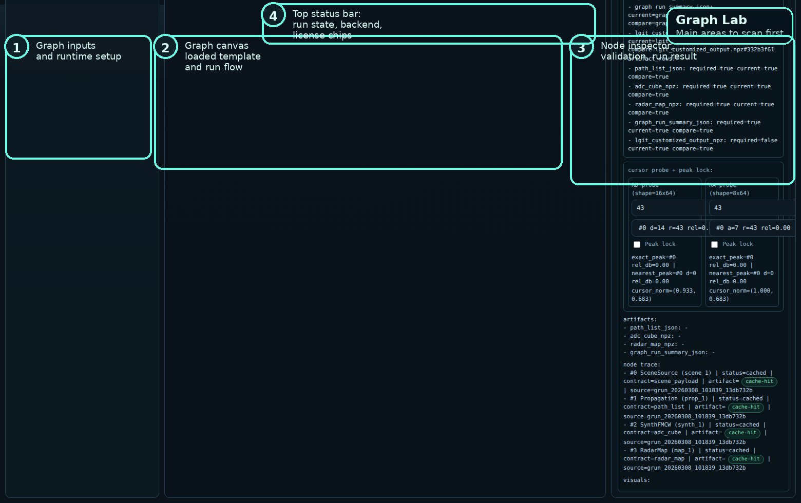
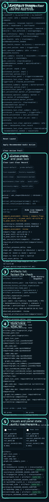
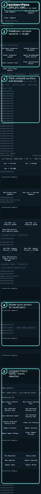

# Graph Lab Live Checklist

## Purpose

Use this while the Graph Lab UI is open.

This is not the full manual. It is the shortest practical checklist for:

- first successful run
- low-vs-high compare
- artifact check
- brief export

For the full explanation, use [Graph Lab UX Manual](300_graph_lab_ux_manual.md).

If one step fails, use [Graph Lab Failure Reading Guide](324_graph_lab_failure_reading_guide.md).

## Open Graph Lab

Run:

```bash
PY_BIN=.venv/bin/python scripts/run_graph_lab_local.sh 8081 8101
```

Open:

- `http://127.0.0.1:8081/frontend/graph_lab_reactflow.html?api=http://127.0.0.1:8101`

Reference screen:



## Checklist A: First Successful Run

### A1. Load A Known-Good Graph

Click:

1. `Refresh Templates`
2. `Load #1`

Expected:

- 4 nodes appear on the canvas
- right panel shows `valid: true` after validation

### A2. Validate Before Running

Click:

1. `Validate Graph Contract`

Expected:

- `Validation Result`
- `valid: true`
- `nodes: 4, edges: 3`

### A3. Set The Fast Baseline Runtime

Click:

1. `Low Fidelity: RadarSimPy + FFD`

Check:

- `Runtime Backend = radarsimpy_rt`
- runtime diagnostics look populated

### A4. Run The Graph

Click:

1. `Run Graph (API)`

Expected:

- top status says `graph run completed`
- right panel `Graph Run Result` says `status: completed`
- a new `graph_run_id` appears

If it fails:

- read [Graph Lab Button Scenario Guide](302_graph_lab_button_scenario_guide.md)
- jump to the `I Want To Know Why Run Failed` scenario

## Checklist B: Confirm Artifacts Exist

Scroll to the right panel `Artifact Inspector`.

Reference screen:



Check in this order:

1. current artifact rows exist
2. `artifacts:` exists
3. these files are listed:
   - `path_list.json`
   - `adc_cube.npz`
   - `radar_map.npz`
   - `graph_run_summary.json`

If you only want this panel, use [Artifact Inspector Quick Guide](304_artifact_inspector_quick_guide.md).

## Checklist C: Build A Low-vs-High Compare

### C1. Save The Current Low Run As Compare

Click:

1. `Use Current as Compare`

Expected:

- compare reference is set

### C2. Switch To High Fidelity

Click one:

1. `High Fidelity: Sionna-style RT`
2. `High Fidelity: PO-SBR`

Use `Sionna-style RT` first for interactive high-fidelity checks. Move to full `PO-SBR` only when Graph Lab is running from `.venv-po-sbr` and you are prepared for a longer run.

Reference:

- [graph_lab_high_fidelity_runtime_timing_latest.json](reports/graph_lab_high_fidelity_runtime_timing_latest.json)

### C3. Run Again

Click:

1. `Run Graph (API)`

Expected:

- current run completes
- compare evidence appears in the right panel

## Checklist D: Use The Fastest Auto Compare

Reference screen:



Click:

1. configure the target runtime in the left panel
2. `Run Low -> Current Compare`

Expected:

- low baseline is created automatically
- target run is created automatically
- compare state is filled

## Checklist E: Decide And Export

Click in this order:

1. `Policy Gate`
2. `Run Session`
3. `Export Brief`

Expected:

- decision/gate state becomes visible
- a brief export is produced

## Fast Failure Reading Order

If something is red, read in this order:

1. top status bar
2. `Graph Run Result`
3. `Runtime Diagnostics`
4. `Artifact Inspector`

Do not start from artifact absence. Read the run error first.

## Related Documents

- [Graph Lab UX Manual](300_graph_lab_ux_manual.md)
- [Graph Lab Button Scenario Guide](302_graph_lab_button_scenario_guide.md)
- [Artifact Inspector Quick Guide](304_artifact_inspector_quick_guide.md)
