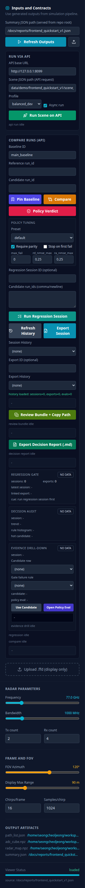
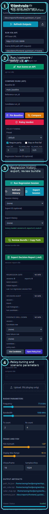

# Classic Dashboard UX Manual

## Purpose

This manual explains how to use `frontend/avx_like_dashboard.html`.

Use it when you want:

- the simpler frontend path instead of Graph Lab
- a quick API-connected dashboard run
- a presentation-friendly view of summary, metrics, detections, and regression controls

For the shortest live sequence, use [Frontend Dashboard Usage](116_frontend_dashboard_usage.md).

If you want a follow-along checklist while the dashboard is open, use [Classic Dashboard Live Checklist](310_classic_dashboard_live_checklist.md).

If you want button meaning by task instead of a full walkthrough, use [Classic Dashboard Button Scenario Guide](312_classic_dashboard_button_scenario_guide.md).

If you want a fast reading guide for result, compare, regression, and export panels, use [Classic Dashboard Result And Evidence Quick Guide](314_classic_dashboard_result_evidence_quick_guide.md).

## Start The Dashboard

Run:

```bash
PY_BIN=.venv/bin/python scripts/run_web_e2e_dashboard_local.sh 8080 8099
```

Open:

- `http://127.0.0.1:8080/frontend/avx_like_dashboard.html?summary=/docs/reports/frontend_quickstart_v1.json&api=http://127.0.0.1:8099`

Healthy first sign:

- dashboard loads
- left control sidebar renders
- scene view, map, metrics, and detection table render

## Screen Map

Full layout:


Annotated full layout:


Control sidebar:



Annotated control sidebar:



Main view:


## Main Areas

1. left sidebar
   - summary path
   - API run controls
   - compare controls
   - regression session/export controls
   - policy tuning
   - radar parameters
2. top scene viewer
   - first-chirp path view
3. radar map area
   - visual output pane
4. metrics panel
   - headline numeric summary
5. detection table
   - path/detection rows

## Left Sidebar Buttons

### Refresh And Inputs

| Button | Use it when | Result |
| --- | --- | --- |
| `Refresh Outputs` | summary JSON has changed | reloads current dashboard data |
| upload icon button | another summary JSON should be used | loads a new local JSON summary |

### Run Via API

| Button | Use it when | Result |
| --- | --- | --- |
| `Run Scene on API` | you want the dashboard to trigger a backend run | sends the configured scene/profile to the API |

### Compare And Policy

| Button | Use it when | Result |
| --- | --- | --- |
| `Pin Baseline` | the current run should become the baseline | stores a baseline record |
| `Compare` | reference and candidate run IDs are available | creates a comparison |
| `Policy Verdict` | compare output should be judged | evaluates the policy outcome |

### Regression And Export

| Button | Use it when | Result |
| --- | --- | --- |
| `Run Regression Session` | you have multiple candidate run IDs | executes a regression session |
| `Refresh History` | session/export lists may be stale | reloads the history lists |
| `Export Session` | selected regression session should be exported | writes an export artifact |
| `Review Bundle + Copy Path` | you want a handoff-ready package | builds bundle and copies its path |
| `Export Decision Report (.md)` | you want a markdown handoff report | writes a decision report |

## Recommended Run Sequences

### Sequence 1: Quick Dashboard Sanity Check

1. start the launcher
2. open the dashboard URL
3. click `Refresh Outputs`
4. confirm:
   - scene viewer is populated
   - radar map area is present
   - metrics show numeric values
   - detection table shows rows

### Sequence 2: Run Via API

1. confirm `API base URL`
2. confirm `Scene JSON path`
3. click `Run Scene on API`
4. confirm status text updates
5. if needed, click `Refresh Outputs`

### Sequence 3: Compare Two Runs

1. fill `Baseline ID`
2. fill `Reference run_id`
3. fill `Candidate run_id`
4. click `Compare`
5. click `Policy Verdict`

### Sequence 4: Regression Session And Export

1. fill `Regression Session ID`
2. fill `Candidate run_ids`
3. click `Run Regression Session`
4. click `Refresh History`
5. choose the session from `Session History`
6. click `Export Session`
7. optionally:
   - `Review Bundle + Copy Path`
   - `Export Decision Report (.md)`

## Healthy Fast Check

The dashboard path is usually healthy if:

- page load succeeds
- API health responds `200`
- `Refresh Outputs` populates the screen
- `Run Scene on API` updates status without error
- metrics and detection rows are visible

## Known Limits

- this dashboard is lighter than Graph Lab
- it is optimized for summary/review flow, not graph editing
- artifact deep inspection is better in Graph Lab

## Related Documents

- [Frontend Dashboard Usage](116_frontend_dashboard_usage.md)
- [Classic Dashboard UX Manual (Korean)](309_classic_dashboard_ux_manual_ko.md)
- [Classic Dashboard Button Scenario Guide](312_classic_dashboard_button_scenario_guide.md)
- [Classic Dashboard Live Checklist](310_classic_dashboard_live_checklist.md)
- [Graph Lab UX Manual](300_graph_lab_ux_manual.md)
- [Generated Reports Index](reports/README.md)
