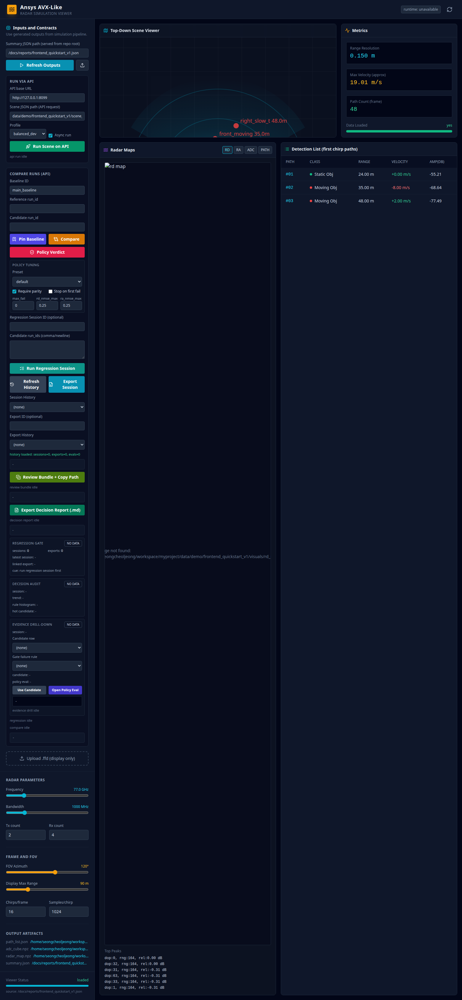
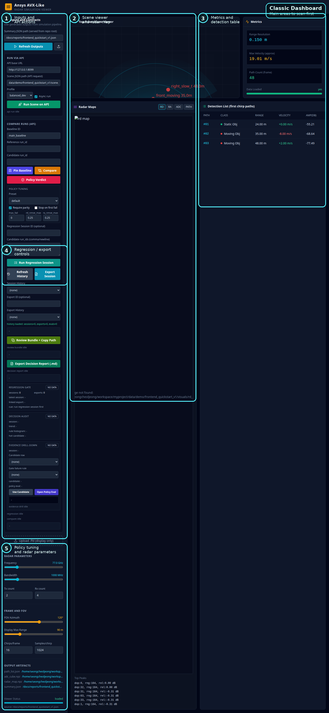
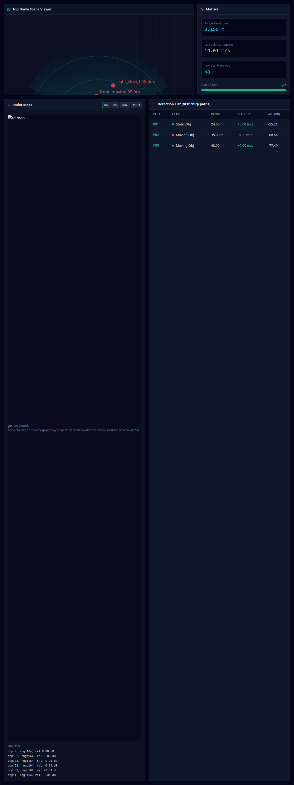

# Classic Dashboard Result And Evidence Quick Guide

## Purpose

Use this guide when the classic dashboard is already open and you want to read the result areas in the right order.

Use it after:

- `Refresh Outputs`
- `Run Scene on API`
- `Compare`
- `Policy Verdict`
- `Run Regression Session`

If you need button meaning first, use [Classic Dashboard Button Scenario Guide](312_classic_dashboard_button_scenario_guide.md).

If you need the shortest click order, use [Classic Dashboard Live Checklist](310_classic_dashboard_live_checklist.md).

## Screen Reference

Full layout:

Annotated full layout:

Main result area:

## Read In This Order

1. `runtime badge` in the header
2. `api run status` in the left sidebar
3. `scene viewer`
4. `radar map area`
5. `metrics panel`
6. `detection table`
7. `compare status` and `compare result box`
8. `regression gate`, `decision audit`, and `evidence drill-down`
9. export path boxes

This order tells you whether the dashboard is merely loaded, whether a backend run actually happened, and whether decision/regression evidence is present.

## What Each Area Means

### 1. Runtime Badge And API Run Status

Look at:

- header `runtime: ...`
- left sidebar `api run status`

Healthy if:

- runtime is not `unknown` after refresh/run
- `api run status` changes from idle to a completed or ready state

Usually unhealthy because:

- API server is not reachable
- scene path or profile is invalid
- backend run failed before outputs were written

## 2. Scene Viewer

This is the top visual area.

Use it to answer:

- did the dashboard load a scene summary at all?
- does the first-chirp path view look populated?

Healthy if:

- a scene image is visible
- it changes after a different summary or run is loaded

## 3. Radar Map Area

This is the main map visualization area.

Use it to answer:

- was RD/RA output generated?
- are you looking at stale or fresh output?

Healthy if:

- the map pane is populated
- map-like output appears together with metrics and detections

## 4. Metrics Panel

This is the numeric summary area.

Use it to answer:

- did the run produce numeric summary data?
- are core headline values present?

Healthy if:

- multiple numeric values appear
- values are not all missing or blank

## 5. Detection Table

This is the fastest proof that output rows exist.

Use it to answer:

- did the run produce detections or path rows?
- do the rows roughly match the current scene/run?

Healthy if:

- table rows are visible
- rows update after refresh/run when inputs change

## 6. Compare Status And Compare Result Box

Look at:

- `compare status`
- `compare result box`

Use it after:

- `Compare`
- `Policy Verdict`

Healthy if:

- status changes away from idle
- the result box contains compare or policy output instead of `-`

Usually unhealthy because:

- `reference run_id` or `candidate run_id` is missing
- baseline/reference/candidate values point to different or stale runs
- compare happened before the backend run finished

## 7. Regression Gate

Look at:

- `Regression Gate` badge
- session/export counts
- latest session/export lines

Use it after:

- `Run Regression Session`
- `Refresh History`
- `Export Session`

Healthy if:

- badge is not `NO DATA`
- counts increase after regression/export actions
- latest session/export lines identify recent activity

## 8. Decision Audit

Look at:

- `Decision Audit` badge
- summary/trend/rule histogram/hot candidate lines

Use it to answer:

- what rule or trend is driving the current decision outcome?
- which candidate is currently the hot spot?

Healthy if:

- audit lines are populated after compare/regression work
- trend and histogram are not `-`

## 9. Evidence Drill-Down

Look at:

- candidate selector
- gate failure rule selector
- `Use Candidate`
- `Open Policy Eval`
- detail box

Use it to answer:

- which candidate row failed or drifted?
- which policy rule is responsible?
- can the current candidate be pivoted into the compare panel?

Healthy if:

- session/candidate/policy lines are populated
- detail box contains structured evidence instead of `-`

## 10. Export Evidence Paths

Look at:

- `review bundle status`
- `review bundle path box`
- `decision report status`
- `decision report file box`
- `regression downloads`

Use it after:

- `Export Session`
- `Review Bundle + Copy Path`
- `Export Decision Report (.md)`

Healthy if:

- a path or file location is shown
- status changes away from idle

## Fast Read By Scenario

### After `Refresh Outputs`

Read:

1. runtime badge
2. scene viewer
3. radar map area
4. metrics panel
5. detection table

### After `Run Scene on API`

Read:

1. `api run status`
2. runtime badge
3. map/metrics/table
4. then press `Refresh Outputs` if the screen still looks stale

### After `Compare` And `Policy Verdict`

Read:

1. `compare status`
2. `compare result box`
3. `Decision Audit`
4. `Evidence Drill-Down`

### After `Run Regression Session`

Read:

1. `regression status`
2. `Regression Gate`
3. `Decision Audit`
4. `regression downloads`

### After Export

Read:

1. `review bundle status`
2. `review bundle path box`
3. `decision report status`
4. `decision report file box`

## Fast Failure Reading Order

If the dashboard looks wrong, read in this order:

1. header runtime badge
2. `api run status`
3. `compare status` or `regression status`
4. `compare result box`
5. export path boxes
6. then rerun the matching checklist in [Classic Dashboard Live Checklist](310_classic_dashboard_live_checklist.md)

## Related Documents

- [Frontend Dashboard Usage](116_frontend_dashboard_usage.md)
- [Classic Dashboard UX Manual](308_classic_dashboard_ux_manual.md)
- [Classic Dashboard Button Scenario Guide](312_classic_dashboard_button_scenario_guide.md)
- [Classic Dashboard Live Checklist](310_classic_dashboard_live_checklist.md)
- [Generated Reports Index](reports/README.md)
