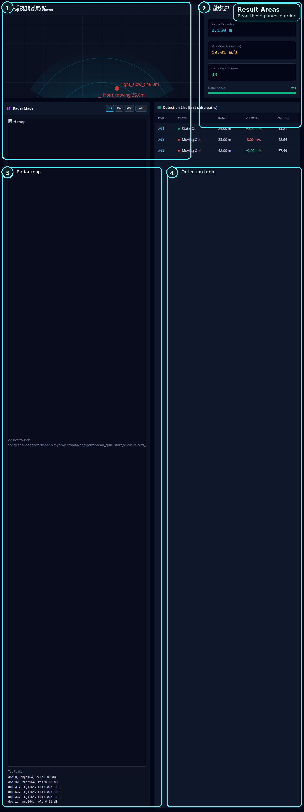

# Classic Dashboard 실패 읽기 가이드

## 목적

classic dashboard를 열어 둔 상태에서, 어떤 플로우가 실패했거나 stale해 보일 때 이 문서를 사용합니다.

다음 액션 뒤에 봅니다.

- `Run Scene on API`
- `Compare`
- `Policy Verdict`
- `Run Regression Session`
- `Export Session`
- `Review Bundle + Copy Path`
- `Export Decision Report (.md)`

전체 화면 설명이 필요하면 [Classic Dashboard UX 사용 매뉴얼](309_classic_dashboard_ux_manual_ko.md)을 보십시오.

가장 짧은 클릭 순서가 먼저 필요하면 [Classic Dashboard 실사용 체크리스트](311_classic_dashboard_live_checklist_ko.md)를 보십시오.

status line을 field 단위로 짧게 보는 cheat sheet가 필요하면 [Classic Dashboard Status Field Guide](319_classic_dashboard_status_field_guide_ko.md)를 보십시오.

## 화면 기준

번호가 들어간 전체 화면:

번호가 들어간 메인 결과 영역:

## 실패는 이 순서로 읽으십시오

1. header `runtime badge`
2. `api run status`
3. `compare status`
4. `regression status`
5. `compare result box`
6. `review bundle status`
7. `decision report status`
8. `Regression Gate`
9. `Decision Audit`
10. `Evidence Drill-Down`

큰 시각화부터 보지 마십시오. 먼저 status line과 path box를 읽으십시오.

## 실패 사례 1: `Run Scene on API`가 실패했거나 stale해 보인다

이 순서로 읽습니다.

1. `runtime badge`
2. `api run status`
3. `Scene JSON path`
4. `Profile`
5. 그 다음 `Refresh Outputs`

주요 원인:

- API server 접속 실패
- scene path 오류
- profile/backend path 오류
- backend run 완료 전에 dashboard를 확인함

가장 빠른 다음 액션:

- `http://127.0.0.1:8099/health` 확인
- [Frontend Dashboard Usage](116_frontend_dashboard_usage.md) 순서 재실행

## 실패 사례 2: Compare 결과가 비어 있거나 의미가 없다

이 순서로 읽습니다.

1. `compare status`
2. `compare result box`
3. `Reference run_id`
4. `Candidate run_id`
5. `Baseline ID`

주요 원인:

- reference/candidate run ID 누락
- baseline/reference/candidate가 stale run을 가리킴
- run 완료 전에 compare를 실행함

가장 빠른 다음 액션:

- run ID가 completed run에서 나온 것인지 확인
- `Compare` 재실행
- 그 다음 `Policy Verdict` 재실행

## 실패 사례 3: Policy Verdict가 납득되지 않는다

이 순서로 읽습니다.

1. `compare result box`
2. `Decision Audit`
3. `Evidence Drill-Down`
4. `Policy Tuning`

주요 원인:

- compare data가 stale함
- policy preset 또는 threshold가 의도와 다름
- 보고 있던 candidate와 실제 hot candidate가 다름

가장 빠른 다음 액션:

- `Decision Audit` summary/trend를 다시 읽기
- `Evidence Drill-Down`에서 candidate/rule 선택
- tuning 후 `Policy Verdict` 재실행

## 실패 사례 4: Regression Session이 history를 만들지 못했다

이 순서로 읽습니다.

1. `regression status`
2. `Regression Gate`
3. `Session History`
4. `Export History`
5. `regression downloads`

주요 원인:

- candidate run ID 형식 오류
- history를 refresh하지 않음
- session은 생겼지만 stale history list를 보고 있음

가장 빠른 다음 액션:

- `Refresh History` 클릭
- `Regression Gate` 확인
- 필요하면 clean candidate ID로 `Run Regression Session` 재실행

## 실패 사례 5: Export가 유효한 file path를 만들지 못했다

이 순서로 읽습니다.

1. `review bundle status`
2. `review bundle path box`
3. `decision report status`
4. `decision report file box`
5. `regression downloads`

주요 원인:

- 유효한 session/export 선택이 없음
- regression history refresh 전에 export를 시도함
- 예전 selection state를 보고 있음

가장 빠른 다음 액션:

- `Refresh History` 클릭
- `Session History` 또는 `Export History` 재선택
- export 액션 재실행

## 실패 사례 6: 화면은 채워졌지만 아직 신뢰가 안 간다

이 순서로 읽습니다.

1. `api run status`
2. `compare status`
3. `Regression Gate`
4. `Decision Audit`
5. `Evidence Drill-Down`
6. export path box

이 경우는 대개 화면은 채워졌지만, 그것이 fresh한지, compare된 것인지, export 가능한지 확신이 없는 상태입니다.

가장 빠른 다음 액션:

- [Classic Dashboard 실사용 체크리스트](311_classic_dashboard_live_checklist_ko.md)의 해당 시퀀스를 다시 실행
- 그 다음 [Classic Dashboard Result / Evidence Quick Guide](315_classic_dashboard_result_evidence_quick_guide_ko.md) 해당 구간을 다시 읽기

## 빠른 판단표

| 무엇이 실패했나 | 먼저 읽을 곳 | 보통 잘못된 것 | 다음 액션 |
| --- | --- | --- | --- |
| API run | `api run status` | API/scene/profile path | health check와 API flow 재실행 |
| compare | `compare status` | missing/stale run ID | completed run 기준으로 compare 재실행 |
| policy verdict | `Decision Audit` | stale compare 또는 wrong preset | tuning 후 verdict 재실행 |
| regression | `regression status` | malformed candidate ID 또는 stale history | history refresh 후 session 재실행 |
| export | export path box | 유효한 session/export 선택 없음 | history refresh 후 export 재실행 |

## 관련 문서

- [Frontend 트러블슈팅 맵](331_frontend_troubleshooting_map_ko.md)
- [Frontend Dashboard Usage](116_frontend_dashboard_usage.md)
- [Classic Dashboard UX 사용 매뉴얼](309_classic_dashboard_ux_manual_ko.md)
- [Classic Dashboard 버튼 시나리오 가이드](313_classic_dashboard_button_scenario_guide_ko.md)
- [Classic Dashboard Result / Evidence Quick Guide](315_classic_dashboard_result_evidence_quick_guide_ko.md)
- [Classic Dashboard 실사용 체크리스트](311_classic_dashboard_live_checklist_ko.md)
