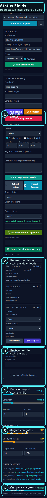

# Classic Dashboard Status Field Guide

## 목적

classic dashboard 버튼 위치는 알지만, 버튼을 누른 뒤 status line과 path box를 어떻게 읽어야 하는지 헷갈릴 때 이 문서를 사용합니다.

해석 대상:

- `api run status`
- `compare status`
- `regression status`
- `review bundle status`
- `decision report status`
- export 영역 아래 path/file box

전체 walkthrough가 필요하면 [Classic Dashboard UX 사용 매뉴얼](309_classic_dashboard_ux_manual_ko.md)을 보십시오.

실패 중심으로 읽고 싶으면 [Classic Dashboard 실패 읽기 가이드](317_classic_dashboard_failure_reading_guide_ko.md)를 보십시오.

## 화면 기준

control sidebar:

번호가 들어간 status field:

## 이 순서로 읽으십시오

1. `api run status`
2. `compare status`
3. `regression status`
4. `regression downloads`
5. `review bundle status`
6. `review bundle path box`
7. `decision report status`
8. `decision report file box`

이 순서는 backend run이 성공했는지, compare/regression이 끝났는지, export path가 실제로 생겼는지 확인하기 위한 순서입니다.

## 각 status field 의미

### `api run status`

언제 보나:

- `Run Scene on API`

정상 신호:

- idle에서 벗어남
- ready/completed 계열 상태를 보여줌

비정상 신호:

- 버튼을 눌렀는데 idle에 머묾
- failure 또는 API-side error를 보여줌

## `compare status`

언제 보나:

- `Compare`
- `Policy Verdict`

정상 신호:

- idle에서 벗어남
- `compare result box`와 같이 채워짐

비정상 신호:

- idle에 머묾
- compare result가 계속 `-`
- run ID가 누락됐거나 stale함

## `regression status`

언제 보나:

- `Run Regression Session`

정상 신호:

- idle에서 벗어남
- refresh 후 `Regression Gate`와 history/export 섹션이 같이 업데이트됨

비정상 신호:

- candidate run ID 형식이 잘못됨
- session은 생겼지만 history refresh를 안 했음

## `regression downloads`

언제 보나:

- `Export Session`

정상 신호:

- download path 또는 export artifact reference가 보임

비정상 신호:

- 계속 `-`
- 먼저 유효한 session/export를 선택하지 않았음

## `review bundle status`

언제 보나:

- `Review Bundle + Copy Path`

정상 신호:

- idle에서 벗어남
- review bundle path box에 실제 path가 같이 보임

비정상 신호:

- idle에 머묾
- bundle path box가 계속 `-`

## `review bundle path box`

언제 보나:

- `Review Bundle + Copy Path`

정상 신호:

- 실제 path가 표시됨
- 새 bundle을 만들면 path가 바뀜

비정상 신호:

- 계속 `-`
- bundle 생성 전에 유효한 export/session context가 없었음

## `decision report status`

언제 보나:

- `Export Decision Report (.md)`

정상 신호:

- idle에서 벗어남
- decision report file box에 실제 path가 같이 보임

비정상 신호:

- idle에 머묾
- report file box가 비어 있거나 `-`

## `decision report file box`

언제 보나:

- `Export Decision Report (.md)`

정상 신호:

- 실제 markdown file path가 표시됨

비정상 신호:

- report path가 기록되지 않음
- session/export context가 준비되기 전에 export를 시도함

## 액션별 빠른 읽기

### `Run Scene on API` 직후

이 순서로 봅니다.

1. `api run status`
2. 그 다음 header runtime badge
3. 그 다음 visuals/metrics

### `Compare` 직후

이 순서로 봅니다.

1. `compare status`
2. `compare result box`

### `Run Regression Session` 직후

이 순서로 봅니다.

1. `regression status`
2. `Regression Gate`
3. `Session History`

### `Export Session` 직후

이 순서로 봅니다.

1. `regression downloads`
2. `Export History`

### `Review Bundle + Copy Path` 직후

이 순서로 봅니다.

1. `review bundle status`
2. `review bundle path box`

### `Export Decision Report (.md)` 직후

이 순서로 봅니다.

1. `decision report status`
2. `decision report file box`

## 빠른 판단표

| 눌렀던 버튼 | 먼저 읽을 곳 | 정상 신호 | 아니면 보통 무엇이 잘못됐나 |
| --- | --- | --- | --- |
| `Run Scene on API` | `api run status` | idle에서 벗어남 | API/scene/profile/backend 문제 |
| `Compare` | `compare status` | non-idle + compare result 존재 | missing/stale run ID |
| `Run Regression Session` | `regression status` | non-idle + history update | malformed candidate ID 또는 stale history |
| `Export Session` | `regression downloads` | export reference 생성 | 유효한 selected session/export 없음 |
| `Review Bundle + Copy Path` | `review bundle status` | path box가 concrete path로 채워짐 | bundle/export context 누락 |
| `Export Decision Report (.md)` | `decision report status` | file box가 concrete path로 채워짐 | report context 누락 |

## 관련 문서

- [Classic Dashboard UX 사용 매뉴얼](309_classic_dashboard_ux_manual_ko.md)
- [Classic Dashboard 실사용 체크리스트](311_classic_dashboard_live_checklist_ko.md)
- [Classic Dashboard Result / Evidence Quick Guide](315_classic_dashboard_result_evidence_quick_guide_ko.md)
- [Classic Dashboard 실패 읽기 가이드](317_classic_dashboard_failure_reading_guide_ko.md)
